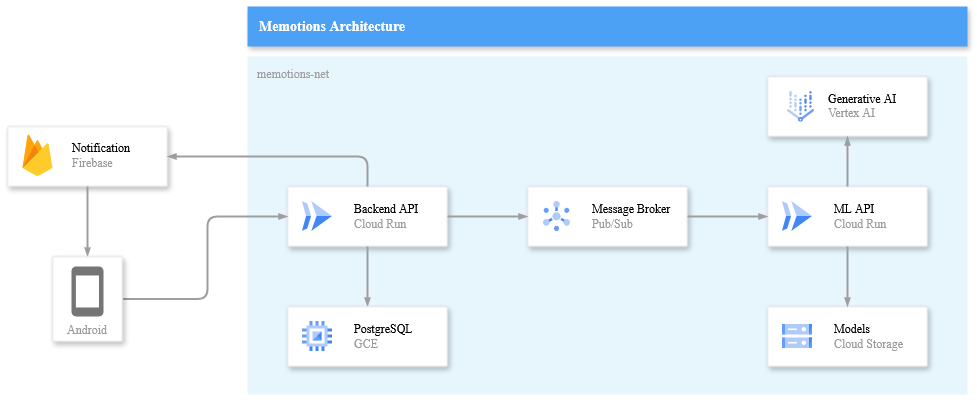

# Backend Service for Memotions

Backend service for the Memotions application, built using TypeScript, Express, and Drizzle ORM. This project provides backend APIs for handling various services and operations related to the Memotions app.


## Cloud Architecture
<div align="center">

</div>


## API Description
This API is developed using TypeScript with Express.js and Node.js as the runtime environment. It supports various endpoints to streamline the business processes of the Memotions application. The API offers:
- Authentication for secure user access.
- Features to add and manage journals.
- Functionality to publish events consumed by a machine learning API for analysis and feedback generation.
- Gamification features like streaks, levels, and achievements to boost user engagement.

The backend employs PostgreSQL, hosted on a virtual machine (VM) instance, as the database solution and leverages cloud storage for managing assets.

## Tech Stack
- Typescript
- Node JS
- Express JS
- Drizzle
- Zod
- PostgreSQL
- Firebase Cloud Messaging
- Cloud Storage
- Pubsub


## Documentation
You can access the full API documentation here:\
[**Memotions API Docs**](https://app.swaggerhub.com/apis/BAYURKP194/memotions-api/1.0.0)

## Getting Started

1. Clone the Repository
```sh
git clone https://github.com/memotions/backend-service.git
cd backend-service/
```

2. Create .env file
```sh
cp .env.example .env
vi .env
# add environment variables
```

3. Install Dependencies
```sh
npm i
```

4. Set Up Database
```sh
npm run db:push
npm run db:seed
```

5. Run the Server
```sh
npm run build
npm run start
```

